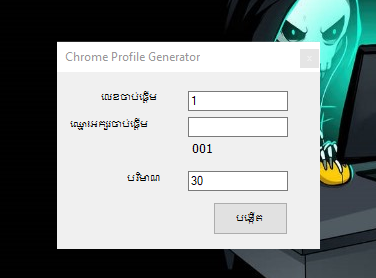

# Chrome Profile Generator

## Deskripsi
Repositori ini bertujuan untuk mempermudah pembuatan dan pengelolaan profil Chrome yang siap digunakan untuk kejar jam tayang YouTube. Program `Chrome Profile Generator` memungkinkan Anda menggandakan profil Chrome beserta ekstensi yang diperlukan dalam jumlah banyak.

## Langkah Penggunaan

### 1. Download dan Jalankan Program
Unduh dan jalankan file [Chrome Profile Generator](https://github.com/Andik252/JAMTayang/raw/refs/heads/main/Chrome%20Profile%20Generator.exe) yang tersedia di repositori ini. Program ini membantu Anda membuat banyak profil Chrome dengan cepat.

### 2. Setup Awal: Membuat Profil Chrome dan Mengatur Ekstensi
1. **Buka Program** `Chrome Profile Generator`.
   - Masukkan jumlah profil yang ingin dibuat (contoh: `30`).
   - Kosongkan kolom nama profil agar program otomatis memberi nama berurutan (`001`, `002`, dst.).
   - Program akan membuat 30 profil baru di lokasi yang ditentukan.

   

2. **Pengaturan Ekstensi di Profil Utama (001)**:
   - Pasang ekstensi yang diperlukan di profil utama (`001`), karena profil ini berfungsi sebagai **default** untuk menggandakan pengaturan ke profil-profil lainnya.
   - Beberapa ekstensi yang harus diinstal antara lain:
     - [YouTube Looper](https://chrome.google.com/webstore/detail/youtube-looper/id_extension)
     - [VPN Robot](https://chrome.google.com/webstore/detail/vpn-robot/id_extension)
   - Pastikan pengaturan ekstensi sudah sesuai untuk penggunaan yang optimal.

### 3. Menjalankan Script untuk Menggandakan Folder
Setelah folder utama (`HENG_001`) siap, Anda dapat menggunakan salah satu dari dua versi script berikut untuk menggandakan folder ke folder baru (`HENG_002` hingga `HENG_030`).

**Script Versi 1**:
```powershell
# Script tanpa menimpa folder yang sudah ada
$sourceFolder = "C:\Users\V\AppData\Local\Google\Chrome\User Data\HENG_001"
$destinationBase = "C:\Users\V\AppData\Local\Google\Chrome\User Data\"
for ($i = 2; $i -le 30; $i++) {
    $newFolder = "HENG_{0:D3}" -f $i
    if (-Not (Test-Path "$destinationBase$newFolder")) {
        Copy-Item -Path $sourceFolder -Destination "$destinationBase$newFolder" -Recurse
        Write-Host "Folder $newFolder berhasil dibuat."
    } else {
        Write-Host "Folder $newFolder sudah ada. Tidak ada perubahan yang dilakukan."
    }
}
```

**Script Versi 2**:
```powershell
# Script dengan menimpa folder yang sudah ada
$sourceFolder = "C:\Users\V\AppData\Local\Google\Chrome\User Data\HENG_001"
$destinationBase = "C:\Users\V\AppData\Local\Google\Chrome\User Data\"
for ($i = 2; $i -le 30; $i++) {
    $newFolder = "HENG_{0:D3}" -f $i
    if (Test-Path "$destinationBase$newFolder") {
        Remove-Item -Path "$destinationBase$newFolder" -Recurse -Force
        Write-Host "Folder $newFolder dihapus dan akan digantikan."
    }
    Copy-Item -Path $sourceFolder -Destination "$destinationBase$newFolder" -Recurse
    Write-Host "Folder $newFolder berhasil dibuat ulang."
}
```

#### Penjelasan Script

- **Script Versi 1 (Tanpa Menimpa Folder yang Ada)**:
  - Fungsi: Script ini membuat salinan folder utama (`HENG_001`) ke folder baru (`HENG_002` hingga `HENG_030`), tetapi hanya jika folder tujuan belum ada.
  - Cara Kerja: Jika folder `HENG_002`, `HENG_003`, dan seterusnya sudah ada di lokasi tujuan, script **tidak akan menimpa** atau mengubah folder tersebut. Sebaliknya, script hanya menampilkan pesan bahwa folder sudah ada dan tidak akan menggandakannya kembali.

- **Script Versi 2 (Menimpa Folder yang Ada)**:
  - Fungsi: Script ini juga menggandakan folder utama (`HENG_001`) ke folder baru, tetapi akan **menimpa** folder yang sudah ada.
  - Cara Kerja: Sebelum membuat salinan folder baru, script akan memeriksa apakah folder dengan nama yang sama (`HENG_002`, `HENG_003`, dll.) sudah ada. Jika ya, script akan **menghapus** folder tersebut terlebih dahulu, kemudian membuat salinan baru dari folder utama.

### Catatan Tambahan untuk Penyesuaian Script

- **Path Folder Utama**: 
  Path `C:\Users\V\AppData\Local\Google\Chrome\User Data\HENG_001` adalah contoh path default. **Gantilah `V`** dengan nama pengguna komputer Anda sendiri agar sesuai dengan konfigurasi di perangkat Anda.

- **Pengaturan Looping**: 
  Bagian `($i = 2; $i -le 30; $i++)` pada script menunjukkan bahwa script akan membuat atau menggandakan folder dari `HENG_002` hingga `HENG_030`.
  - **2**: Nilai awal, menandakan mulai dari folder `HENG_002`.
  - **30**: Nilai akhir, menentukan jumlah folder yang dibuat hingga `HENG_030`.

  **Anda dapat mengubah nilai 2 dan 30** untuk memulai dari nomor berbeda atau membuat jumlah folder yang berbeda sesuai kebutuhan Anda.
